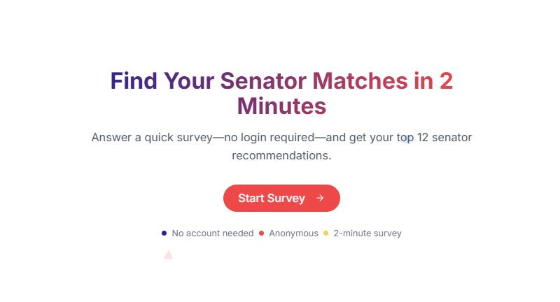

# SenatorMatch 🇵🇭

[](https://senator-match.vercel.app)

SenatorMatch is a volunteer-led, non-partisan civic education platform designed to help Filipino voters understand how their values and policy preferences align with senatorial candidates. By answering a quick, anonymous survey, users receive personalized recommendations of candidates whose public stances most closely match their views.

## Core Purpose

In an increasingly complex political landscape, SenatorMatch aims to:

*   **Empower Voters:** Provide accessible and unbiased information to help citizens make more informed decisions.
*   **Promote Civic Engagement:** Encourage active participation in the democratic process by making political information easier to understand and compare.
*   **Enhance Transparency:** Offer insights into where candidates stand on key issues, based on publicly available data and research.
*   **Be Non-Partisan:** The platform is not affiliated with any political party, candidate, or government body and is provided free of charge.

## Key Features

*   **Anonymous Survey:** No login or personal identification required to take the survey.
*   **Personalized Matches:** Receive a list of senatorial candidates whose stances align with your survey responses, with top matches highlighted.
*   **Detailed Candidate Profiles:** (Assumed feature - can be verified) Explore candidate information, including their positions on various issues.
*   **Issue Explanations:** Understand the context of key political issues in the Philippines with explanations in both English and Tagalog.
*   **Educational Focus:** Designed for informational and educational purposes only, not as an endorsement of any candidate or party.

## Tech Stack

SenatorMatch is built with a modern web stack:

*   **Frontend:** Next.js (React Framework), TypeScript
*   **Backend:** FastAPI (Python Framework)
*   **Database:** MongoDB
*   **Styling:** Tailwind CSS, Radix UI (for UI components)
*   **State Management:** Zustand
*   **Form Handling & Validation:** React Hook Form, Zod
*   **Deployment:** Frontend on Vercel (or similar for Next.js), Backend on AWS Lambda

## Development Process

This project was initially scaffolded using [v0.dev](https://v0.dev) and then further refined and developed with the assistance of Cursor to enhance its functionality and ensure seamless integration.

## Getting Started

To get a local copy up and running, follow these simple steps.

### Prerequisites

*   Node.js (v18.x or later recommended)
*   pnpm (or npm/yarn)

### Installation & Running Locally

1.  **Clone the repository:**
    ```bash
    git clone https://github.com/YOUR_USERNAME/SenatorMatch.git # Replace with actual repo URL when public
    cd SenatorMatch
    ```

2.  **Install dependencies:**
    ```bash
    pnpm install
    ```
    (Or `npm install` / `yarn install`)

3.  **Run the development server:**
    ```bash
    pnpm dev
    ```
    (Or `npm run dev` / `yarn dev`)

    Open [http://localhost:3000](http://localhost:3000) with your browser to see the result.

4.  **Build for production:**
    ```bash
    pnpm build
    ```

## Contributing

SenatorMatch is a volunteer-driven project. We welcome contributions from developers, researchers, designers, and anyone passionate about civic technology and voter education in the Philippines!

Once the project is fully open-sourced, contribution guidelines will be available here. In the meantime, if you're interested in contributing, please reach out to the contact email below.

## License

This project will be licensed under an open-source license (e.g., MIT License, Apache 2.0). The specific license will be determined and added here when the project is publicly released.

## Contact

For questions, feedback, or if you're interested in getting involved:

*   **Email:** [data.datospilipinas@gmail.com](mailto:data.datospilipinas@gmail.com) (as found in `terms-and-conditions.tsx`)

---